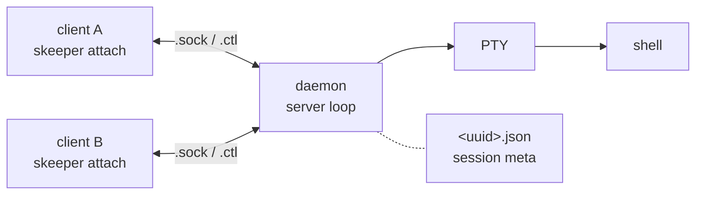

# skeeper

Minimal terminal session keeper.

[](https://github.com/dak-ia/skeeper/actions/workflows/test.yml)

## 📖 Overview / 概要

`skeeper` keeps shell sessions alive across terminal disconnects. Unlike tmux/screen, skeeper focuses solely on **session persistence** — no window management, no key bindings, no scripting layer. Each session is a single shell + PTY that survives client disconnects; attach and detach are plain subcommands.

`skeeper`は、ターミナルが切れてもshell sessionを生かし続けるためのツールです。tmux/screenのようなwindow管理・key binding・scripting層は持たず、**セッション永続化**だけに絞っています。1つのsessionは1つのshellと1つのPTYから成り、client側が落ちても残り続けます。attachとdetachはそれぞれ独立したsubcommandで扱います。

Design pillars / 設計方針:

- **Do one thing / 1つのことに徹する** — session persistence, nothing else.
- **Multi-client / Multi-client対応** — multiple terminals can attach to the same session simultaneously; each sees the same PTY output.
- **Recoverable / 障害復旧しやすい** — metadata on disk lets `list`/`prune` inspect and repair sessions after crashes.

## 🚀 Quick start

```sh
# Create a new session and attach / 新規sessionを作成してattach
skeeper new myproject

# Create without attaching / attachせず作成だけ
skeeper new -d myproject

# List current sessions / 一覧
skeeper list

# Attach to a session (or omit the name for a picker) / attach(名前省略で対話pickerが開く)
skeeper attach myproject

# Detach current attach (daemon and shell keep running) / 現attachから抜ける(daemonとshellは残る)
skeeper detach

# Kill a session and clean up its files / sessionを終了しfileも掃除
skeeper kill myproject
```

Every subcommand has a short alias: `n` `a` `ls` `d` `r` `k` `p`.

各subcommandには短いaliasが用意されています: `n` `a` `ls` `d` `r` `k` `p`。

`skeeper list --detail` (short: `-d`) also shows attached clients, TTYs, SSH origins, and attach times.

`skeeper list --detail`(短縮は`-d`)を使うと、attach中のclientのTTY・SSH origin・attach時刻まで一覧に表示されます。

## 📦 Installation / インストール

```sh
git clone https://github.com/dak-ia/skeeper.git
cd skeeper
cargo install --locked --path .
```

Requires **Rust 1.96.1** (pinned via `rust-toolchain.toml`).

**Rust 1.96.1**が必要です(`rust-toolchain.toml`で固定しています)。

### 📘 Manpage

The generated `docs/man/skeeper.1` is tracked in the repository. Install locally:

生成済みの`docs/man/skeeper.1`はリポジトリにcommit済みです。ローカルにインストールする手順は以下のとおりです:

```sh
sudo mkdir -p /usr/local/share/man/man1
sudo cp docs/man/skeeper.1 /usr/local/share/man/man1/
# Then / それから: man skeeper
```

If `man skeeper` still says "no manual entry", check that `/usr/local/share/man` is in your `manpath` (run `manpath` to inspect). Homebrew on Apple Silicon typically uses `/opt/homebrew/share/man` instead.

`man skeeper`で「no manual entry」と出る場合は、`manpath`を実行して`/usr/local/share/man`が含まれているかを確認してください。Apple SiliconのHomebrew環境では`/opt/homebrew/share/man`が使われているのが一般的です。

For the full command reference, use `skeeper --help`, `skeeper <subcommand> --help`, or the manpage.

全subcommandの詳細な仕様は`skeeper --help`・`skeeper <subcommand> --help`・またはmanpageを参照してください。

## 🏗 Architecture / アーキテクチャ



Runtime files live under `$XDG_RUNTIME_DIR/skeeper/` (or `$HOME/.skeeper/run/` when XDG is unset):

実行時ファイルは`$XDG_RUNTIME_DIR/skeeper/`配下(XDG未設定時は`$HOME/.skeeper/run/`)に置かれます:

| file | purpose | 用途 |
| --- | --- | --- |
| `<uuid>.json` | session metadata (name, cwd, shell, pid, attached-clients) | セッションメタ(名前・cwd・shell・pid・attach中のclient) |
| `<uuid>.sock` | PTY data — clients read stdout, write stdin | PTYの入出力 |
| `<uuid>.ctl` | control messages — detach, rename, session switch, current-client query | 制御(detach・rename・session切替・現clientのquery) |

## 🛠 Development / 開発

```sh
# Full test suite (workspace: skeeper + xtask) / workspace全体のtest
cargo test --workspace --all-targets --no-fail-fast

# Format and lint / フォーマットとlint
cargo fmt --all
cargo clippy --workspace --all-targets -- -D warnings

# Regenerate skeeper.1 after editing the CLI / CLI変更後のmanpage再生成
cargo mangen
```

CI runs `test` on `ubuntu-latest` + `macos-latest`, plus `fmt`/`clippy`/`mangen-check` on `ubuntu-latest`.

CIでは`test`を`ubuntu-latest` + `macos-latest`のmatrixで、`fmt`/`clippy`/`mangen-check`を`ubuntu-latest`単独で走らせています。
